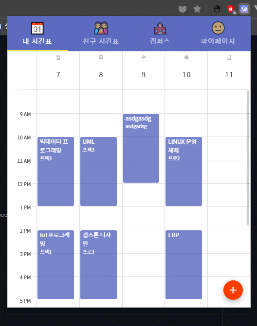
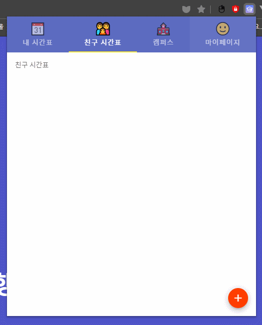
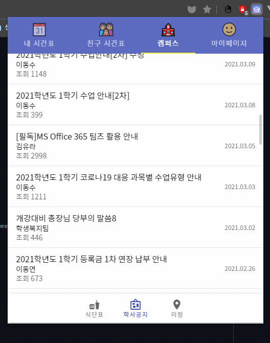

<h1 align="center">Daelim Pick 👋</h1>


<br/>
<h2>2021-1 캡스톤 디자인</h2>
<h2>Daelim Pick</h2>
<p>시간표 관리와 친구 시간표 보기, 학교 공부 확인을 이용 할 수 있는 chrome extension입니다.</p>

### 📅 <a href="https://chrome.google.com/webstore/detail/%EB%8C%80%EB%A6%BC%ED%94%BD/beabgbjleckdhifhckdekgjkhnkinnjf?hl=ko&">chrome 웹 스토어에서 다운로드</a>






## Scripts 👨‍💻

```json
// project setup
cd server & npm i
cd client & npm i

// compiles and hot-reloads for development
npm run serve
npm run dev

// Run unit tests
npm run test:unit
```

## Contributors ✨

<table>
  <tr>
    <td align="center"><a href="https://github.com/ggoya0820"><br /><sub><b>ggoya0820</b></sub></a><br />UI/UX🐈</td>
    <td align="center"><a href="https://github.com/DuYeong0020"><br /><sub><b>DuYeong0020</b></sub></a><br />back-end🍿</td>
    <td align="center"><a href="https://github.com/GOing445"><br /><sub><b>GOing445</b></sub></a><br />back-end🍿</td>
    <td align="center"><a href="https://github.com/dalcon10028"><br /><sub><b>dalcon10028</b></sub></a><br />front-end🍿</td>
  </tr>
</table>
